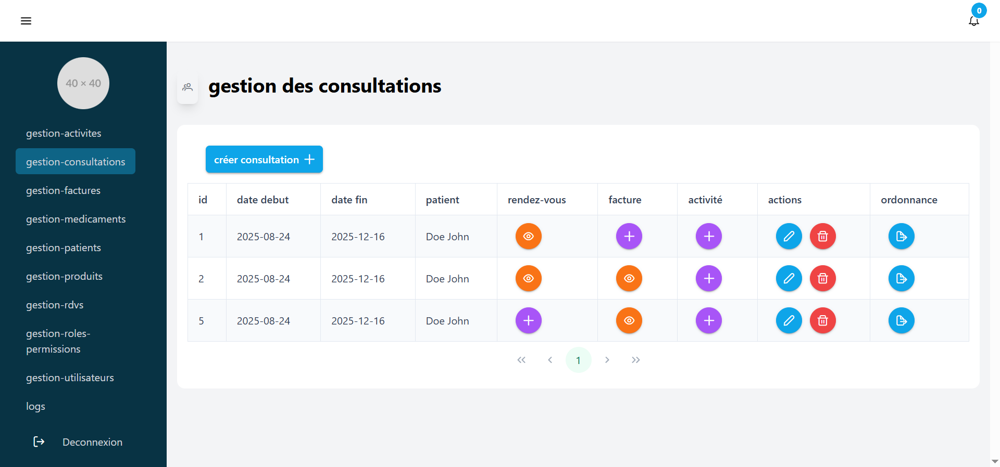
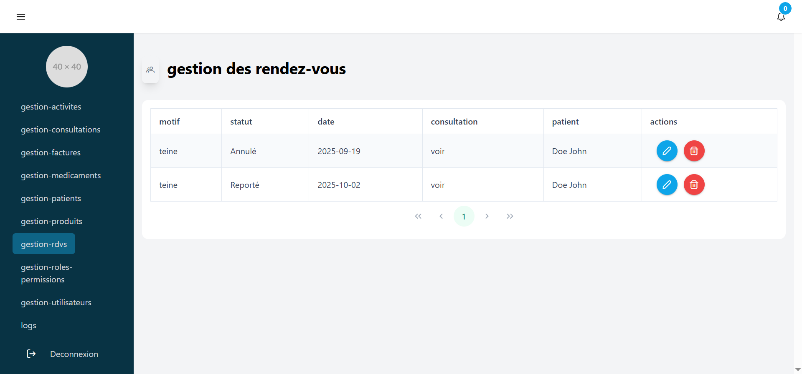

# 🏥 Cabinet Médical
## 📖 Description

Le projet Cabinet Médical est une application web complète développée avec Spring Boot pour le backend et Angular pour le frontend.
Elle permet la gestion des patients, médecins, rendez-vous et dossiers médicaux au sein d’un cabinet.
L’objectif est de digitaliser la gestion médicale et d’offrir une interface simple, fluide et sécurisée pour les utilisateurs (patients, médecins, administrateurs).

#### 🚀 Fonctionnalités principales

* Gestion des utilisateurs
* Création et authentification des comptes : administrateur, médecin, secrétaire, patient.
* Attribution de rôles et gestion des permissions.
* Mise à jour du profil utilisateur.

#### 🗓️ Gestion des rendez-vous

* Ajout, modification et suppression des rendez-vous.
* Affichage du calendrier des médecins.
* Notifications de confirmation ou d’annulation.

#### 🧾 Dossiers médicaux

* Création et consultation des dossiers patients.
* Historique des consultations, ordonnances et analyses.
* Téléversement de fichiers médicaux.

#### 📊 Tableau de bord administratif

* Vue d’ensemble : nombre de patients, rendez-vous, médecins, etc.
* Statistiques et graphiques dynamiques.

#### 🛠️ Technologies utilisées
| Catégorie  | Technologie |
| ------------- |:-------------:|
| Frontend      | Angular 17, TypeScript, HTML, CSS, Tailwind    |
| Backend      | Spring Boot 3+, Java 17+|
| Base de données      |    MySQL |
|API | RESTful|
| Sécurité | Spring Security|


#### ⚙️ Installation et exécution
##### Cloner le projet
```
git clone https://github.com/af38/cabinet-medical-app.git
cd cabinet-medical
```


Le projet contient deux dossiers principaux :
```
cabinet-medical/
├── app/          # Projet Spring Boot
└── clientv2/     # Projet Angular
```

#### Installation du backend (Spring Boot)
📂 Aller dans le dossier *app* :
```
cd app
```
```
🧩 Configurer le fichier application.properties :
spring.datasource.url=jdbc:mysql://localhost:3306/votre_db
spring.datasource.username=root
spring.datasource.password=
spring.jpa.hibernate.ddl-auto=update
spring.jpa.show-sql=true
server.port=8080
```

▶️ Lancer le serveur Spring Boot :
```
mvnw.cmd spring-boot:run
```

Le backend sera disponible sur :

*http://localhost:8080*

### Installation du frontend (Angular)
📂 Aller dans le dossier frontend :
```
cd ../clientv2
```

#### Installer les dépendances :
```
npm install
```

Lancer le serveur Angular :

```
npm start
```


Le frontend sera accessible sur :
```
👉 http://localhost:4200
```

🔗 Communication entre frontend et backend

L’application Angular communique avec Spring Boot via des API REST.
L’URL du backend doit être configurée dans un fichier d’environnement Angular, par exemple :

```
// environment.ts
export const environment = {
  apiUrl: 'http://localhost:8080/api'
};
```

#### 📄 Licence

Ce projet est distribué sous la licence MIT.
Vous êtes libre de l’utiliser, le modifier et le partager.


## Emphasis

*This text will be italic*
_This will also be italic_

**This text will be bold**
__This will also be bold__


### Ordered

1. Item 1
2. Item 2
3. Item 3
    1. Item 3a
    2. Item 3b

## captures d'écran
### Gestion de consultations


### Gestion des rendez-vous


### Logs


